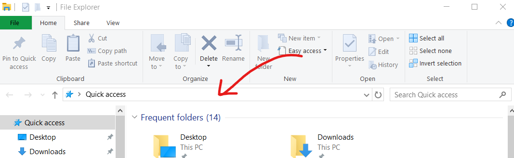

# utilscripts
A collection of random scripts I've written. They're all pretty quick & dirty - I generally write these to solve annoying yet highly specific problems I encounter, so they aren't really plug-and-play. The code is fairly simple and everything is commented, though, so modifying things for your needs shouldn't be too complicated.

As a side note, my main system is currently running Windows 10, so YMMV with anything else.

## The Scripts
### deversionify
Long story short, I used to do everything on a Very Old laptop with lots of hard drive issues & I occasionally have to restore folders from Windows Backup. The easy thing to do is to just copy them over when I need them, but the backup program adds ugly timestamps to the filenames which *breaks everything* when you have code that relies on files having specific names.

To fix this incredibly annoying problem, `deversionify.py` is a simple python script that goes through every file in the folder where you run it and removes the timestamp from the file name if it finds one. Currently, it doesn't handle empty filenames very well: `(UGLY TIMESTAMP).gitignore` doesn't get modified. I don't deal with enough of those files to warrant fixing it yet, though. Someday...

### caesar
`caesar.py` is a really simple program that generates every possible [Caesar cipher](https://en.wikipedia.org/wiki/Caesar_cipher) from a text file in the same folder as the script. It only shifts letters, because I threw this together during a CTF and that was all I needed it to do.

### vidsmaller
`vidsmaller.py` minifies mp4 files (according to the arguments you give it) in the folder where you run it. **It uses ffmpeg & won't work if you don't have it installed!** Check out the help text (`vidsmaller -h`) for info about the different arguments available. It's basically a glorified wrapper for ffmpeg, because while I was working on a project I needed to minify a bunch of videos & figure out which configuration saved the most space.

## Bonus Round: Run It From Anywhere!
A lot of these scripts deal with things in the directory where the script is, but moving the script around (or worse, moving your other files around) is terrible. Also, you could type `python path/to/the/script.py` every time you want to run it but that's no fun. Remember, the entire theme of this repo is putting an absurd amount of work into making your life easier!

These steps apply to Windows (I spent hours researching so you don't have to!). For another OS, the internet will help you more than I can. Also: you will need admin privileges.

**DO THESE STEPS ONCE:**
1. Make a folder for all your scripts. Doesn't really matter where, just somewhere permanent.
2. Add that folder to your PATH:
  - Control Panel -> System -> Advanced System Settings -> Environment Variables
  - In the System Variables section, scroll until you find the one called `Path`. Click on it to select it, then press Edit.
  - Press New, then paste the path of the scripts folder you created.
  - Press OK, OK, OK.
  - This will make your life marginally easier even if you don't do the other steps - now you can just run `python script.py` instead of including the entire file path.
3. Most of these scripts are written in python, so add the `.py` extension to your `PATHEXT` environment variable. This tells Windows that python scripts are executable.
  - It's the same process as adding a folder to your PATH, but this time, append `.PY` to the list. The extensions are separated with semicolons.

**DO THESE STEPS FOR EACH SCRIPT**
1. Make sure it's in the scripts folder that you added to your path.
2. Open up an **administrator** command prompt (right click start menu -> Command Prompt (Admin))
3. run `mklink [NAME_OF_PROGRAM] [FULL_PATH_TO_PROGRAM]`
  (for example, `mklink deversionify C:\Users\Liz\Documents\scripts\deversionify.py`)

### Run from File Explorer
Fun fact! You can run commands from the address bar in File Explorer.

If you did all the steps above, to run a script in a certain folder, just type its name in the address bar! This works *beautifully* for deversionify.